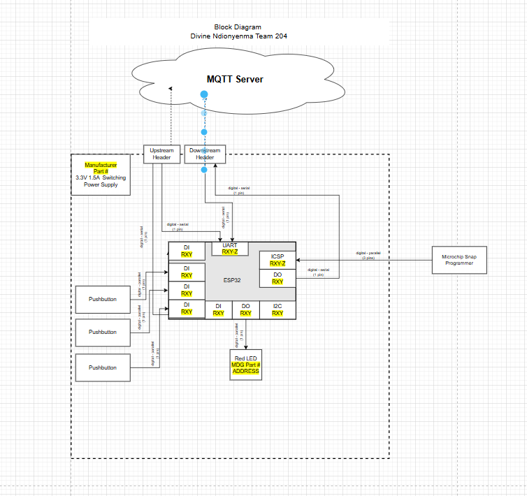

# Block Diagram

## Communication Flow

---

## Diagram Summary

The ESP32 module acts as the central controller, interfacing with the MQTT server wirelessly and handling local inputs/outputs via GPIO and UART. The 3.3V regulated power ensures safe operation of the ESP32 and peripherals.

